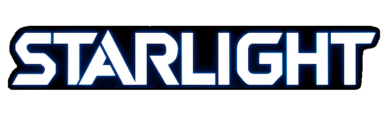

<p align="center">
  
</p>

<h1 align="center">🚀 Starlight Launcher</h1>

<p align="center">
  Modern launcher for <b>Space Station 14</b> built by the Starlight Team.
</p>

<p align="center">

[](https://discord.gg/wXJmswM5yt)
[](https://github.com/ss14Starlight/Starlight.Launcher)

</p>

<p align="center">


</p>

<p align="center">


</p>

---

## ✨ About

**Starlight Launcher** is a modern alternative launcher for **Space Station 14**.

Created by the **Starlight Team**, it focuses on:

- 🎨 Modern and responsive UI
- ⚡ Improved performance
- 🔧 Advanced customization options
- 🧩 Extensible architecture

---

## 🌟 Features

- Multi-account support
- Rich launcher settings
- Theme customization
- Discord integration(statuses and OAuth)
- Null link

---

## 🛠 Built With

- [.NET](https://dotnet.microsoft.com/)
- [.NET MAUI](https://learn.microsoft.com/dotnet/maui/)
- [Blazor Hybrid](https://learn.microsoft.com/aspnet/core/blazor/hybrid/)
- Space Station 14 Launcher API

---

## 🚀 Getting Started

### Requirements

- .NET SDK 9.0+
- Visual Studio 2022 / Rider

### Build

```bash
git clone https://github.com/ss14Starlight/Starlight.Launcher.git
cd Starlight.Launcher
dotnet build
```

### Run

```bash
dotnet run
```

---

## 🤝 Contributing

Contributions, bug reports and feature requests are welcome.

1. Fork repository
2. Create feature branch
3. Commit changes
4. Open Pull Request

---

## 💬 Community

- Discord: https://discord.gg/wXJmswM5yt
- GitHub Issues: https://github.com/ss14Starlight/Starlight.Launcher/issues

---

## 📄 License

### MIT

All source code is licensed under the MIT License.

### CC BY-SA 3.0

All non-code assets, including icons and sound files, are licensed under CC BY-SA 3.0 unless stated otherwise.
